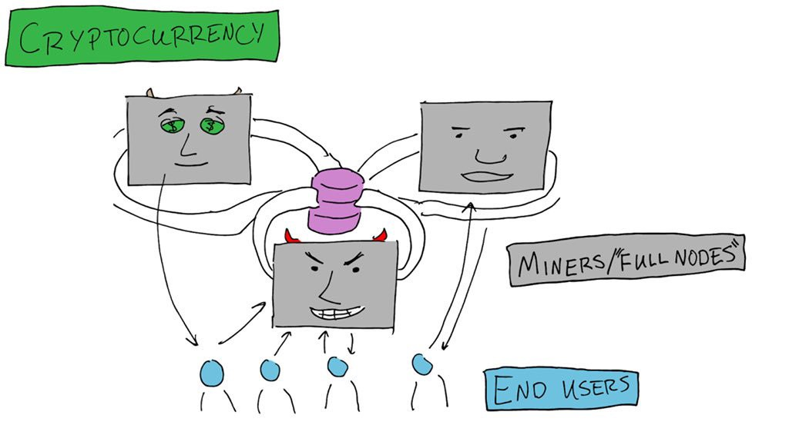

# Coda 协议 — 一个简洁的区块链协议

原文：https://medium.com/@masked/the-coda-protocol-bbcb4b212b13

翻译：Star.LI (star@trapdoortech.com)

Coda协议可以看成是 “**能塞进口袋的钱包**”：

- 第一个**简洁**的区块链加密货币。
- 区块链从100 GB的数据（现有的区块链协议）压缩到**kB大小**。
- **可扩展，安全且去中心化**。
- 允许在**手机**上验证区块链。

Coda区块链无论在网络上进行多少交易，始终保持恒定大小（**几条推文的大小**）。

https://cdn.embedly.com/widgets/media.html?src=https%3A%2F%2Fwww.youtube.com%2Fembed%2FeWVGATxEB6M%3Ffeature%3Doembed&amp;display_name=YouTube&amp;url=https%3A%2F%2Fwww.youtube.com%2Fwatch%3Fv%3DeWVGATxEB6M&amp
hack.summit(“blockchain”) 2018 — Izaak Meckler — co-founder and CTO, Coda Protocol

*在“加密世界”中，我们经常被鼓励遵循“不信任，验证”的座右铭。虽然区块链需要全节点，但是很少节点愿意做全节点，因为对全节点的要求越来越高。*

​							          比特币的区块链数据增长（从2009年到2018年，MB为单位） 

​                                (https://www.blockchain.com/en/charts/blocks-size?timespan=all)

------

# 前言

**为什么不是每个人都能成为一个全节点？**深入研究之前，我们应该首先了解典型的加密货币协议的基本操作 - 节点（也称为矿工或权益人（分别对应于PoW与PoS））将交易应用于世界状态。然后，全节点会观察这些交易，以确保其行为诚实。终端用户通常不独立进行验证，而是将信任委托给全节点。**这是为什么？**

- 硬件的要求和运行全节点的复杂性不鼓励终端用户自己去验证。
- 在计算机上运行全节点非常复杂，在手机上无法运行。
- 信任第三方来完成验证更容易。

在任何一种特定的加密货币的早期，由于区块链很小（*可能只有几兆字节*），操作整个节点相对容易。但是，随着时间的流逝和记录更多的事务，它会增长到数百GB（如上图所示）。也就是说，在一般的计算机上维护节点不太现实，更别提在**智能手机**上了。

**如何在不需要历史交易的情况下，确认当前区块链状态的正确性？**

# Coda介绍

> “ Coda是一种新的加密货币协议，**具有全节点级安全性**，它**允许在任何设备上与任何人进行网络同步。而做到这些，仅需下载**几千字节的数据**（而不是上GB的数据）并进行几毫秒的计算**。”

https://cdn.embedly.com/widgets/media.html?src=https%3A%2F%2Fwww.youtube.com%2Fembed%2F4AJKUGNwzZ0%3Ffeature%3Doembed&amp;display_name=YouTube&amp;url=https%3A%2F%2Fwww.youtube.com%2Fwatch%3Fv%3D4AJKUGNwzZ0&amp
Izaak Meckler & Evan Shapiro: Coda — A Succinct Blockchain — Epicenter

**O(1) Labs**正在开发“Coda协议”，以通过创建第一个“简洁的”或“压缩的区块链”（几条推文的大小）来解决区块链数据大小的问题。这为终端用户提供了*较低的进入门槛*验证交易。

**这是怎么做到的？**

- 利用zk-SNARK有效地将区块压缩为单个证明。
- **终端用户检查此证明**，而不是检查整个块的交易历史。
- SNARKs的递归证明实现了区块链数据的恒定大小。

*zk-SNARK是零知识证明的一种加密方案，在向验证者提供计算证明时，验证者获取不到任何知识（零知识）。*

# Coda如何工作

## **Coda中的zk-SNARKs**

Coda协议的核心是**zk-SNARKs**。zk-SNARKs能用来验证**任何计算**。

zk-SNARKs提供“不可伪造的证明”，能证明计算正确执行，而无需提供整个计算过程。如前所述，我们可以对*任何*计算，例如验证一个块中的交易，创建一个SNARK的证明。此证明无需显示所有交易即可证明区块交易历史的准确性。这样**有效地将区块的大小减小到单个SNARK证明（〜1kB）。**

**SNARK的证明会证明共识需要的所有的规则。**

**这些规则包括：**

- *交易的签名是否正确。*
- *交易是否有效。*
- *共识相关的规则（PoW的总算力以及链的强度，PoS的VRF函数以及其他规则）*

SNARK证明必须真实生成，否则无效。网络中的任何人都可以在类似**Raspberry Pi **或**智能手机**之类的“轻节点”上验证。

*在低端计算设备上能验证区块的正确性是针对当前问题的可持续且可扩展的解决方案的第一步。*

节点间可以传递SNARK的证明，而不必传输区块中的所有交易。

> **节点和终端用户之间的真实的对话：**
>
> “嗨，验证者/终端用户！我创建了一个证明，以便您可以轻松地验证区块中的交易。这个过程需要大量的计算能力，因此我也获得奖励。您可以通过检查SNARK证明来验证准确性，该过程仅需要几毫秒和几千字节的存储空间。这样，您无需下载数百GB的数据即可验证区块链！” — SNARK节点。
>
> 
“非常感谢您，节点。我将验证此证明！由于它是如此之小，我不必委托其他人来为我验证区块链数据，我终于可以在诸如智能手机之类的设备上运行一个验证节点和钱包。谢谢！现在的生活真好。” — 终端用户。

## **每个区块用SNARK证明代替，还不是完整的方案**

最初，我们认为可以为每个区块简单地创建一个SNARK证明，将每个区块数据缩小到大约一千字节，并将其命名为day（天）。但是，随着SNARK的堆积，这仍将导致区块数据*线性增长*，尽管程度要比现有的区块链小得多。

## **如何进一步解决数据量的问题?**

我们知道一个SNARK证明可以验证任何计算。创建一个SNARK证明本身也是一种计算，那**能不能创建一个SNARK证明能证明多个SNARK证明？**

​													每个都被终端用户验证过的SNARK证明

## Coda递归证明

如前所述，我们可以将这些证明以递归组合的形式“链接”在一起，并将区块链保持〜20kB **的恒定大小（SNARK证明 + Merkle路径）**。

每次每生成一个新块，就会生成一个新的SNARK证明。该证明能证明之前的所有的证明，也就是说，一个证明能证明所有的从创世纪的区块到最新区块的所有的交易状态。

​																多个SNARK证明被“压缩”成一个SNARK证明

## **简单的说，假设你有**:

- 一个证明能证明**区块0到区块2**是正确的。
- 另外一个证明能证明**区块2到区块4**是正确的。

你能用**一个新的SNARK证明**，将上述的两个证明“合并”，证明**区块0到区块4**是正确的。

**新的SNARK证明大小为 ~1kB.** 从更大范围来说，可以为区块链的所有区块（整个交易历史）创建一个SNARK证明，该证明的**大小恒定不变**。随着区块的增多，越来越多的“证明”被压缩到最新的SNARK证明中。

## **验证节点需要信息：**

一个**递归生成的zk-SNARK证明（1kB）**，以及一个**默克尔树的路径**。SNARK证明能证明所有的交易历史的正确性。这两个信息一起能证明一个用户的账户信息的正确性。所有这些信息只需要毫秒级时间就能同步完。

终端用户验证当前状态，其中包括所有所有交易的SNARK证明以及默克尔路径。这些信息可以让一个用户可以验证其余额。

# 应用程序，去中心化以及可扩展性

## 应用程序

Coda协议使终端用户可以轻松地通过**浏览器和应用程序“访问”区块链**，而无需下载数百GB数据，并且无需委派信任。

*想象一下一个应用程序，例如超轻量级钱包，不需要相信开发人员可以正确执行验证过程。终端用户并不需要特殊的硬件就可以完成验证过程*。

**任何设备都可以运行验证节点，** *包括但不限于* **智能手机**，**浏览器**或**功能手机**（是的，包括坚不可摧的诺基亚）。

## 去中心化

当今现有加密货币协议的终端用户将信任委托给在线钱包或轻节点等服务。如果发生51％的攻击，这可能会成为问题，因为验证交易的责任通常集中在这些服务提供商。

通过提供简易的验证方式，广大的终端用户能直接进行验证，从而**增强了去中心化能力**。

## 可扩展性

就扩展性而言，如果现有区块链协议将TPS提升到上千的话，区块链数据量将增加，不可避免地会遇到增长速度超过其可验证性的问题。

然而，Coda协议将其区块链保持在恒定大小，也就是可以减轻验证交易所需的数据。同时因为验证数据被压缩了多个数量级，Coda协议实现高吞吐量。

# 总结

通过创建固定数据大小的区块链，Coda协议**降低了终端用户验证交易的门槛**。

- **毋需委托信任**给目前传统区块链协议的全节点。
- **拥有全节点等级的安全性**。任何设备只需要下载**一个SNARK证明**和默克尔路径就可以验证交易。
- 采用**递归证明**的方法，Coda协议将区块链数据恒定在**～20kB**左右。
- 因为降低了终端用户验证交易的门槛，**增强了去中心化的能力**。

## **有意思的想法**

你可以将Coda协议想像成精灵宝可梦的宝贝球。Coda协议，就像将卡比兽压缩进宝贝球一样，将交易信息压缩成固定大小的SNARK证明。

​                                                                摘自ZCon0 — Izaak Meckler

​                                             https://www.youtube.com/watch?v=qCVACpgQSjo