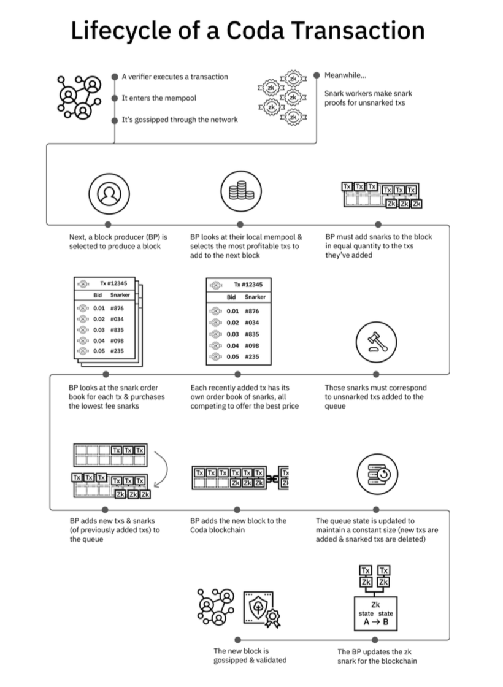
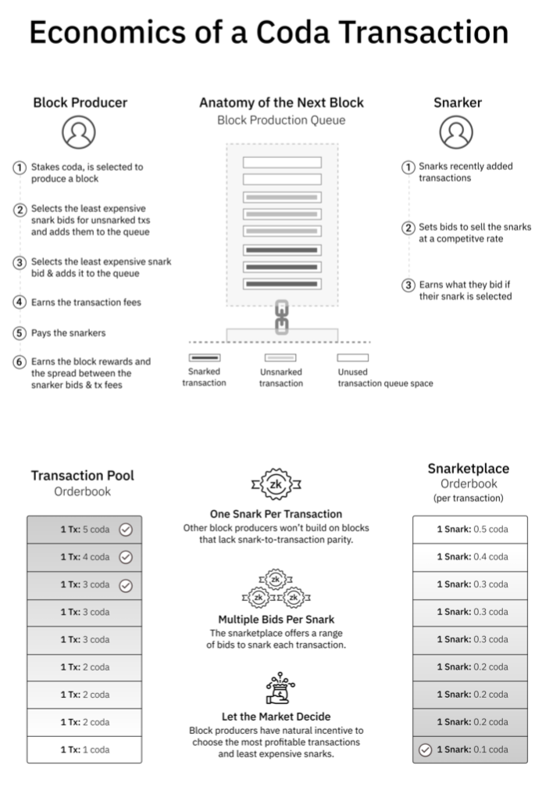
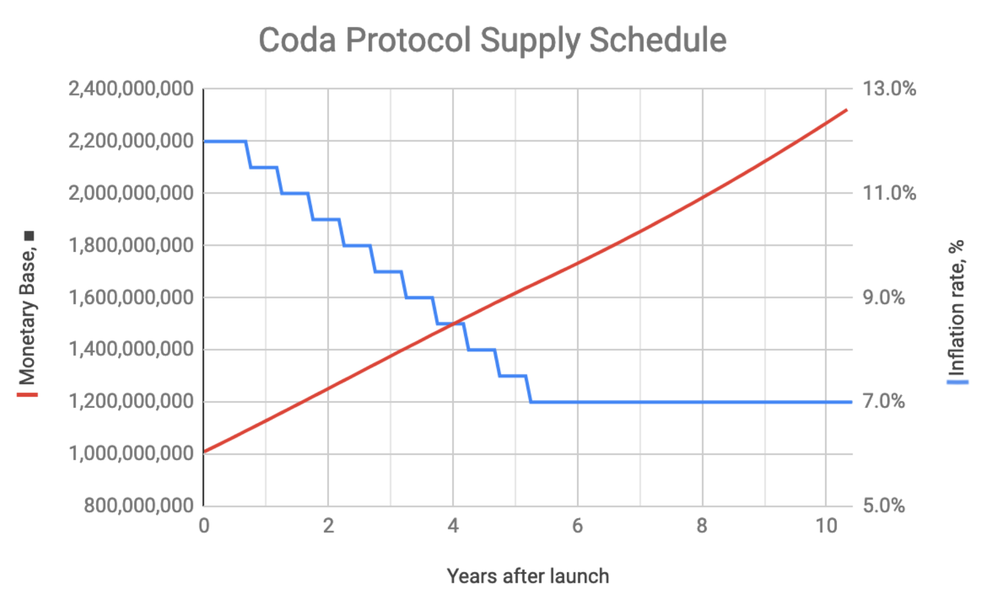
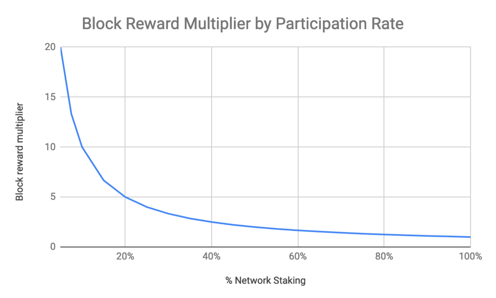

## **Coda：经济模型和货币政策**

**Brad Cohn, Evan Shapiro, and Emre Tekişalp**

O(1) Labs

January 16, 2020

原文：https://codaprotocol.com/static/pdf/economicsWP.pdf

翻译：**Star.LI** (star@trapdoortech.com)

公众号：**星想法（sparkbyte)**

**摘要**

随着加密货币变得越来越流行和广泛使用，验证区块链的成本与总交易量成线性增长，对于大多数普通用户而言，变得无法承受。这样的话，加密货币可能成为他们自己成功的受害者，普通用户无法直接验证区块链，必须相信中介机构。 Coda协议通过用易于验证的证明替代区块链数据解决此问题。Coda协议需要仔细设计角色，激励，采用合理的货币政策，确保正常运行并且避免不公平。本篇文章主要介绍Coda协议的各种考量。

### 1 介绍

将加密技术与经济激励相结合，比特币[Nak09]成为了第一个去中心化的点对点支付协议。比特币设计的一个关键是协议的各个组成部分相互制衡。比如，工作量证明（POW）生成区块需要成本，从而阻止作恶者提交无效交易。但是，存储区块链历史交易会极大地增加这种动机，因为它可以以非常低的计算成本立即对网络上的所有节点进行篡改。这种技术（使攻击成本高昂，防御成本低廉）是现代密码学的基石，也是精心设计的密码经济协议的标志。
但是，比特币的设计有一些局限性。尽管区块链可以快速检测区块或者交易是否正确，但是并不能较快地提供正确性的证据。实际上，每次新节点加入网络时，他们都必须检查从创始区块开始的每笔交易，以验证其正确性。该要求随着总交易吞吐量的增长呈线性增长，并且对于大多数普通用户而言，在智能手机等资源受限的设备上，这种要求很快就变得遥不可及。**随着加密货币变得越来越流行和广泛使用，它们最终成为自己成功的受害者，普通用户越来越难以验证区块链数据，而这些用户又不得不信任中介机构。**
递归的zk-SNARK是解决这个难题的一个方法。类似于区块链可以恒定时间检测区块数据的正确性，递归zk-SNARKs能够实现在恒定时间对区块链状态进行验证。网络节点，不再是本地验证区块数据，而是生成交易的正确性证明（zk-SNARK），并广播这些证明。因此，最终用户获得了能证明区块链正确的zk-SNARK证明，可以无需中介机构来确定区块数据的正确性。**简而言之，Coda协议以易于验证的证明取代了区块链区块数据。**有关此协议的技术实现的更多详细信息，请参阅技术白皮书[MRS19]。
Coda协议需要仔细设计角色，激励，采用合理的货币政策，以正常运行并避免不公平。本篇文章主要介绍Coda协议的各种考量。

### 2 网络角色以及激励

大多数加密货币协议在其网络中至少具有两个角色：1）验证网络中每个交易的角色，通常称为全节点，权益持有者或矿工； 2）信任第三方为其验证交易的角色，例如轻节点。这些协议验证区块链历史交易变得越来越昂贵，因此更多的参与者不能充当全节点，只能作为轻节点。例如，即使比特币平均每秒少于1.5笔交易，新加入的全节点也必须验证近500,000,000笔交易才能拥有全节点安全性。这个问题在一些加密货币中变得更加复杂，这些加密货币声称具有比特币交易吞吐量的10倍至100,000倍，因此在最大交易量下每周都会生成GB级或TB级的数据。
相比之下，Coda对资源的需求是不变的：无论网络处理了多少交易，用户都可以通过一个小的zk-SNARK来完全验证当前状态。为了支持这一点，Coda网络中具有三个角色，每个角色通过不同的机制鼓励参与。

#### 2.1 验证节点

我们希望绝大多数网络参与者有能力验证区块链状态。由于Coda使用递归zk-SNARK证明来证明状态有效性，因此只需下载大约数百个字节的zk-SNARK证明，只花费几毫秒的计算时间就能验证整个区块链状态，从而可实现全节点安全性。 zk-SNARK证明证明了区块链共识信息和最新的区块链状态的Merkle树根。也就是说，验证者可以请求区块链状态对应的Merkle路径。通过验证Merkle路径，验证者可以确保他们关心的状态部分（例如帐户余额）确实包含在zk-SNARK证明的区块链状态中。

#### 2.2 区块生产节点

区块生产者类似于其他协议中的矿工或抵押者。通过以区块奖励以及用户支付的交易费来激励区块生产节点。重要的是，Coda采用的是Ouroboros [DGKR17]共识算法，因此没有区块生产节点大幅减少的威胁。除了直接抵押之外，个人还可以抵押给其他块区块生产者。这样，通过委托，权益持有者自己不需要生产区块。
通常，区块生产者选择要在下一个块中包括哪些交易。显然，最高费用的交易被鼓励加入区块。但是，为了确保区块链保持简洁，区块生产者还要承担额外的责任：对于添加到区块中的每笔交易按序生成SNARK证明。如果他们不按照共识算法生成区块，他们的区块将被其他节点拒绝。可以在脑海中想象一个交易队列，如果区块生产者想要将10个交易添加到区块中（以便以获取交易费用），他们必须对队列的10个交易按序生成SNARK证明。他们可以自己生成这些SNARK证明，也可以从市场中挑选证明生成节点生成证明。

#### 2.3 证明生成节点

技术Coda白皮书[MRS19]中描述的证明生成节点也是网络参与者，他们生产可验证交易的zk-SNARK证明。证明生成节点在市场公布自己的证明生成费用，如果在一个块中使用其SNARK证明，则区块生产者从总交易费用中支付这些费用。
鉴于许多不同的证明生成节点可以为交易证明发布费用，并且激励生产者愿意采用最低的证明生成费用，这自然形成了一个市场。证明生成节点可以参与竞争以提供最具成本效益的zk-SNARK证明。为了方便起见，我们可以将其称为证明生成市场。下面，我们将评估该经济模型。
首先，只要网络上存在一定数量的证明生成需求（由区块生产者网络保证），证明生成市场便不会影响协议的活跃性或抗审查性，因为总会有区块生产者选择某个证明生成节点生成证明。
为此，考虑具有空闲计算能力的网络参与者，以及由于缺少证明生产而导致网络上的证明费用上升，当证明费用超过该参与者的证明生产的边际成本时，如果他们是理性的经济行为体，他们将开始提供高于其生产价格且低于市场价格的出价以获取利润，从而稳定了证明费用。区块生产者可以简单地将这些费用转嫁给交易者。实际生成证明的计算成本应非常低，以当前的云计算价格计算，每笔交易的费用不到一美分。
其次，考虑到规模经济，随着时间的推移，像比特币一样，运营可能会变得更加占主导地位。但是，由此产生的证明生产集中度都不会影响该协议的抗审查性或活跃性。这是因为任何人都可以以一定的价格生产证明。即使有一些证明生产者可以提供更便宜的证明，但如果他们拒绝处理某些交易，网络上的其他任何节点也可以以更高的费用提供证明，并且仍然会激励区块生产者将其打包。第三，也许一个明确的自协调机制可以防止重复生成证明，这可能会减少证明费用和网络上的计算浪费，但是这种机制对于协议的安全性或活性不是必需的。

#### 2.3.1 抗审查性

可能有必要在支持抗审查性上多说几句。尽管有很多针对比特币抗审查性的可能的攻击[NBF + 16]，但事实证明，只要您支付足够高的费用或等待足够长的时间，您就可以被包括在一个区块中。 Coda与比特币非常相似，但又增加了复杂性，您还需要在将包含在区块中的交易进行证明。
因此，要使Coda不抗审查，就必须将交易包含在一个区块中，然后不对其进行证明。这将要求所有证明生成节点（拒绝对该交易生成证明）或所有区块生产节点（选择不将交易打包）之间进行合谋。根据Ouroboros的假设，我们可以假设网络是分散式的，因此节点之间不会互相勾结。
再说证明生成节点。因为证明生成的计算成本非常低，并且任何人都可以生成，所以要使所有证明生成节点串通要比使所有区块生产者串通要困难得多。现有的证明生成节点无法阻止新的证明生成节点进入市场。如果某人发现某笔交易未在证明市场中进行交易，他们可以轻松而有利地向市场提出报价，即使交易费用非常低，区块生产者也可以从打包某交易获利。
																	

​															**Coda交易生命周期**

​															

​												**Coda交易经济的各种角色**

### 3 命名

货币的单位称为Coda，以货币符号∎（UTF-16：U + 25FC）表示。Coda的初始供应量是10亿。每个Coda可分为10亿个nanocoda。货币的中间面额使用标准度量标准前缀：

1. ∎1 = 1 coda
2. ∎0.01 = 1 centicoda (分)
3. ∎ $1^{-6}$ = 1 microcoda

### 4 货币政策

Coda使用的是变种的Ouroboros[DGKR17] [MRS19]的POS共识算法，因此区块奖励和交易费用和抵押比例有关。因此，在抵押的参与度高的情况下，通货膨胀将抵消，从而确保一个帐户对Coda的持有比例保持不变。但是，那些不选择抵押或委派的人相对于那些选择抵押或委派的人将受到稀释。为了激励参与者从一开始就抵押，Coda的通胀率将从12％开始。五年后，通货膨胀率将下降到7％，此后默认情况下将保持在7％，具体取决于治理。

重要的是，Coda协议的通货膨胀率和抵押的比例无关。这意味着区块奖励将动态变化只和通货膨胀率相关。例如，如果抵押率仅为50％，那么块奖励将增加一倍。这是因为对于每个权益持有者来说，每个时期产生的区块个数和抵押的比例成比例。这自然会鼓励更多的个人在低抵押率时进行投资。

降低通货膨胀率时的主要考虑因素是确定区块奖励是否高于区块生产者有足够的动机去验证而不需要大幅提升交易费用。

货币政策对Coda协议的后续开发也很重要。以区块奖励的通货膨胀形式，激励区块生产者进行验证来保护区块链免受攻击。但是，安全性不是新的区块链网络的唯一要求。协议的长期维护和改进也需要资金。我们建议最合适的机制是创建特殊的区块奖励，并通过治理进行奖励的发放。

**参考：**

[DGKR17] Bernardo David, Peter Gaži, Aggelos Kiayias, and Alexander Russell. Ouroboros praos: An adaptively-secure, semi-synchronous proof-of-stake protocol. Cryptology ePrint Archive, Report 2017/573, 2017. http://eprint.iacr.org/2017/573.

[MRS19] Izaak Meckler, Vanishree Rao, and Evan Shapiro. Coda: Decentralized Cryptocurrency at Scale, 2019.

[Nak09] Satoshi Nakamoto. Bitcoin: A peer-to-peer electronic cash system, 2009.

[NBF+16] Arvind Narayanan, Joseph Bonneau, Edward Felten, Andrew Miller, and Steven Goldfeder. Bitcoin and Cryptocurrency Technologies: A Comprehensive Introduction, 2016. Feather Forking.